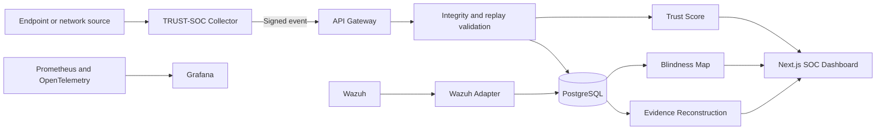

# Architecture

## Control plane

The FastAPI service provides authentication, authorization, inventory, telemetry ingestion, integrity verification, trust scoring, rule dependencies, blindness analysis, evidence reconstruction, simulation authorization, reporting, and integration adapters.

## Data plane

Collectors run on monitored endpoints. Every source receives a unique identifier and shared secret. Events include a monotonic sequence, previous-event hash, canonical event hash, and HMAC signature. A local spool retains events during network interruption. Production deployments should replace shared-secret provisioning with certificate-based enrollment and hardware-backed keys where possible.

## Processing flow

## Enterprise scaling path

- Separate ingestion, control-plane, analysis, and reporting services.
- Kafka or managed event streaming for high-throughput buffering.
- ClickHouse/OpenSearch for large telemetry volumes; PostgreSQL remains the control database.
- Kubernetes with separate node pools and network policies.
- Wazuh multi-node server and indexer clusters for high availability.
- External identity provider using OIDC/SAML and enforced MFA.
- Vault/KMS/HSM-backed secrets and collector identities.
- Object storage with retention locking for evidence.
